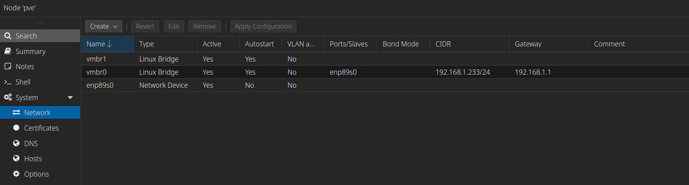
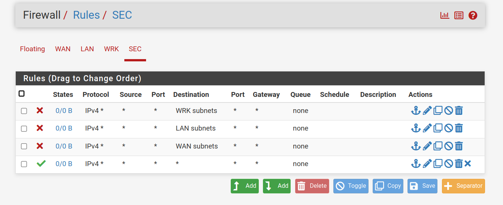

# About

Some months ago, I purchased an [Intel NUC 11](https://www.amazon.com/gp/product/B09KNK3R29?psc=1) to set up a basic home lab. Making this purchase, I had a few things in mind. I wanted to:

- Have a platform for building custom virtual networks.
- Be able to host many VMs to emulate a real network with many endpoints.
- As a bonus, host game servers on dedicated hardware for my friends and I.

Building such virtual infrastructure would give me a platform to practice my cybersecurity skills in whatever kind of environment I can create. As an aspiring cybersecurity professional, this possibility was very attractive to me. When I got it, I quickly installed [Proxmox Virtual Environment](https://www.proxmox.com/en/proxmox-virtual-environment/overview) and got to work building my network. After many hours of work and troubleshooting, I managed to build a viable home network. My old virtual network was built with:

- A [pfSense](https://www.pfsense.org/) firewall which served as the heart of my network.
- A domain controller to set up and manage an Active Directory domain.
- Two windows endpoints joined to my domain.
- A Kali Linux VM set up on a separate network segment than the Windows devices.
- [Snort](https://www.snort.org/) in IPS mode as a plugin for pfSense.
- [OpenVPN](https://openvpn.net/) also as a plugin for pfSense.

Configuring and deploying all of this taught me a lot about firewall configuration and gave me a good opportunity to practice the network skills I acquired when pursuing the CompTIA Network+ certification. Shortly after building this, however, I began my internship at PSEG and did not have much time time to play around with it. Now, about 6 months later, I have a more time on my hands to actually put such a network to use. Although the infrastructure was already in place, I felt as if I could do better if I gave it another shot with everything I know now. That is why, this morning, I deleted everything in my Proxmox VE and have decided to start fresh. Over the past few months I've learned a lot more about blue teamining via TryHackMe's "SOC Level 1" path and now want to put what I've learned in practice. That is why, for this new lab, I will incorporate some new technologies such as:

- [Security Onion](https://securityonionsolutions.com/): A great SIEM and powerful network monitoring solution.
  - Includes tools like Suricata, Zeek, and Elasticsearch.
  - Can perform full packet captures, threat hunting, and forensic investigations.
- [Wazuh](https://wazuh.com/): A fully-featured XDR platform.
  - This can be integrated into Security Onion to provide visbility into both the network and endpoints.
  - Can perform compliance monitoring and benchmark the security of endpoints, providing recommendations on hardening devices.
- A VM for DFIR tasks that will include tools such as Autopsy, Redline, and KAPE.
- A malware analysis and reverse engineering VM such as Flare VM or Remnux VM.

For the first phase of setting this lab up, I will focus on the primary security infrastructure. When everything is complete, the network should look like this:

**INSERT NETWORK DIAGRAM**

# Security Infrastructure

## Configuring Proxmox VE

I already have Proxmox installed on my server and will not be covering my installation of it. I did, however, delete all of the network interfaces for my previous lab aside from the default `vmbr0`. For my last lab I used a strange solution where I had a separate network interface for each different network when I could have just used pfSense's VLAN features. This time, therefore, we will only require one extra network interface: `vmbr1`. This will serve as our `LAN` interface.

## pfSense

### Installation

As with my last lab, pfSense will be the heart of my infrastructure; all traffic will be routed through pfSense and it will be the default gateway for all devices. First, we download the latest ISO from [here](https://www.pfsense.org/download/). Any ISO can be uploaded to PVE by clicking on `local (pve)` on the list to the left and then selecting `Upload` or `Download from URL`. When the ISO is on PVE, hitting `Create VM` on the top right of PVE will open the wizard for creating our pfSense VM, `FW01`. I don't allow the VM to boot right after finishing the configuration, because there is one extra thing we have to do: adding an interface for `vmbr1`, which can be done in the networks settings of `FW01` quite easily. Upon booting into the VM, I allocated 32 GB of storage, 8 GB of RAM, and 4 cores to my firewall and proceeded through the installer. My WAN interface is set to `vtnet0` which corresponds to `vmbr0` and my LAN interface is set to `vtnet1` which corresponds to `vmbr1`.

I do not set up VLANs now, as that is easier to do in the web interface. Upon completing the installation, I try to login to pfSense's web interface but am unable to connect. There are two problems here:

- The LAN interface has the default IP of `192.168.1.1/24`.
- By default, pfSense only allows connections to the web interface via the LAN interface, which we do not yet have access to.

To resolve this, we first use the console to update the LAN interface's IP to `10.10.10.1/24` and set up DHCP to allocate IPs in the range `10.10.10.200-10.10.10.254`. This is mainly for when a device is first being set up, as we will try to use static IPs for most of this lab. Next, we need to be able to access pfSense from the WAN interface. Upon research, it seems that the packet filter can be disabled from the pfSense console using `pfctl -d` until we are able to properly configure it to allow webConfigurator traffic from my home network.

Now that I am able to access the webConfigurator, I can continue the setup process after logging in with the default credentials `admin:pfsense`. I have a static IP configured on my router for my previous pfSense installation, so I attach that during this configuration process.

### General Configuration

Now that we've made it to the web interface, the first thing we want to do is add a rule to allow access to it from my home network so we can re-enable packet filtering. Our rule is of the form `FROM 192.168.1.0/24 TO Firewall(self) ALLOW TCP 80`. Besides that, we must also disable the default rule blocking `WAN` traffic from private IP addresses.

We then go to `Interfaces>Assignments>VLANs` to set up our first VLAN. The configuration is shown below.

Now that the VLANs have been configured, we have to create interfaces with them by going to `Interfaces>Assignments`. To add them, all you have to do is press the button to do so. I then click on the names `OPT1` and `OPT2` to rename them to their VLAN and to enable them.

Both of these interfaces are also configured with a static IPv4 address: `10.10.20.1/24` and `10.10.30.1/24` respectively. That aside, each interface also needs its own DHCP server; these can be configured under `Services>DHCP Server`.

### Firewall Rules

#### Setting Up a Test Device

For the sake of testing if our firewall rules are actually working, we are going to set up `LNX01` on the `WRK` VLAN. The setup for this is the same as any other VM on PVE, except when it comes to configuring our network interface, we are going to select `vmbr1` and set a VLAN tag of `10` to put it on our `WRK` VLAN. `LNX01` runs Debian; there is nothing special about its setup. To let all traffic through on the network for now, we set an "allow all" rule:

Now that we have a test device set up, let's get to making our rules.

#### Default Rules

Our devices on VLANs should not just be able to reach out to any IP; this is why we have to set firewall rules. By default, pfSense ACLs deny all incoming traffic. Since our VLANs should have internet access, we need a rule to allow outbound traffic with a few exceptions. The VLANS should not be able to reach my home network or other VLANs. Therefore, we will add rules to block these from being accessed in addition to a rule allowing all other traffic out.

That concludes our setup of pfSense. We will make changes to our firewall rules and configurations as needed going forward.

## Security Onion

